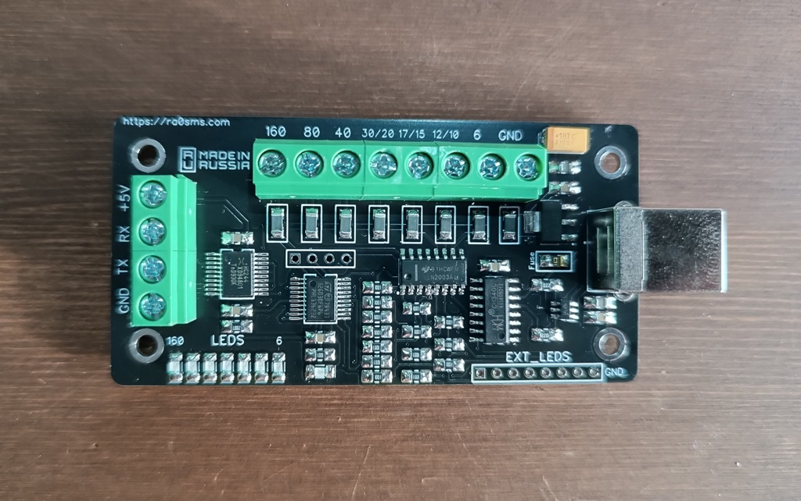
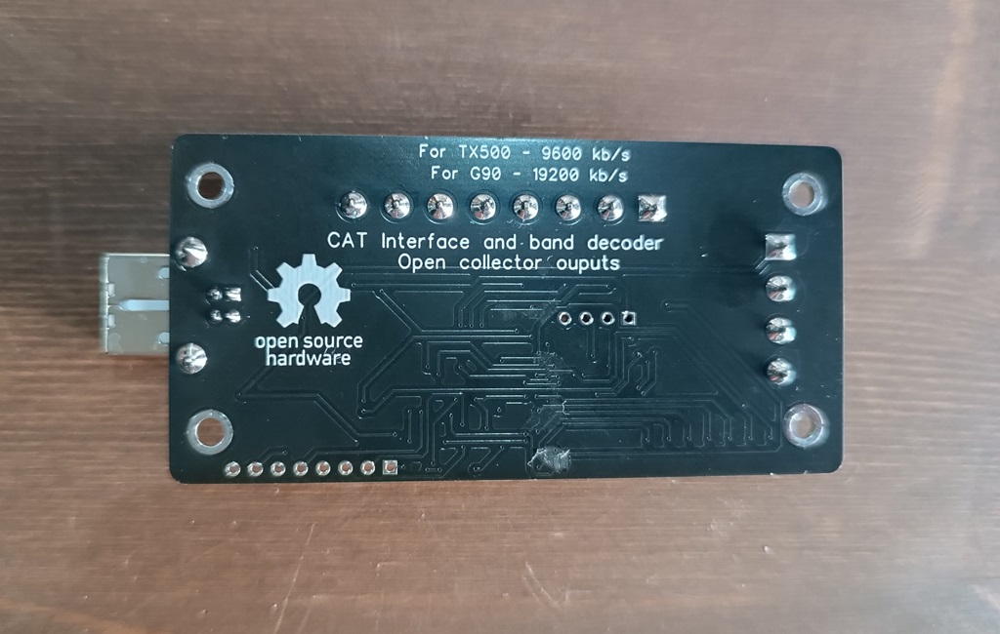

# Band decoder for LAB599 and Xiegu transceivers

More information here - https://ra0sms.com/tx500-g90-banddecoder/

It works via CAT protocol.

19200 kb/s - for Xiegu

9600 kb/s - for LAB599

## Schematic

## PCB

PCB dimension - 80*40mm

Power supply via USB

Outputs - open collectors (ULN2003)

